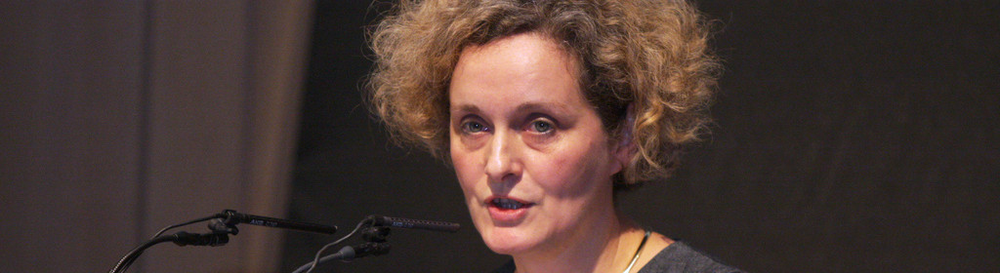



## Vita

Ursula Damm is media artist and professor for Media Environments at the Bauhaus University in Weimar,
where she is also involved in establishing the Digital Bauhaus Lab. 
She envisioned the Neurovision Sandbox and uses it as part of her artistic process.

## Links

- [More about Ursula Damm](http://www.ursuladamm.de)
- [Academic Page at Bauhaus Universität Weimar](http://www.uni-weimar.de/medien/wiki/GMU:Start)
