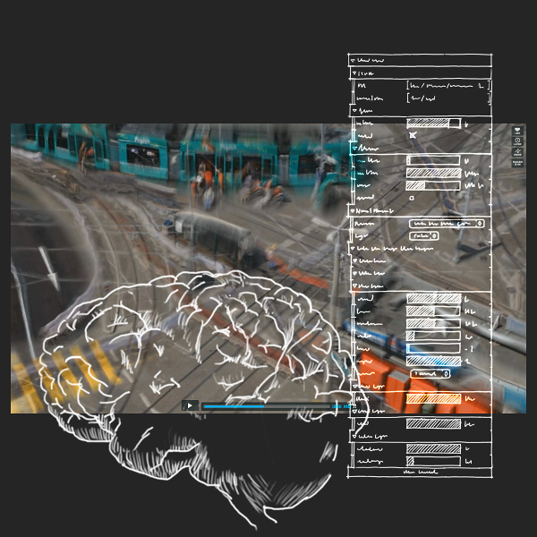



**Generative Video Processing with Neural Networks**

## Abstract

**NeuroVision** is a web-based sandbox for Generative Video Processing in the browser. 
It is used to transform live-video from mobile devices and webcams, based on colors, flows and rhythms.  
We will learn how to process video-feeds and web-videos with Neural Networks and use NeuroVision as an artistic tool for our own video-recordings.

## The Neurovison Sandbox

Sandboxes are an important tool for teaching creative coding practices to artists:  
[Sketchpad.cc][1] is a popular sandbox based on Processing that lets students explore computation visually and collaboratively. An other sandbox that is more centered on parallel programming enabled by GPUs is [Pixelshaders.com][2].

With NeuroVision we introduce a sandbox for GPU-based video processing.  
We have used this sandbox in our own work, including *Transits*[^1] and the *Neural Chromatographic Orchestra*[^2] and would now like to share it and make it available as a tool for artists that want to use live-video-processing in their work.

## Sign Up

**You can now sign up for the workshop!**

Once you have submitted your Mediacities [Registration][10],  
you can visit the **[Sign Up Page](http://mediacities.net/site/workshop-signup/)**
to register for this workshop.  
You better be quick, since the size of the workshop is limited.

## Registration Fee

The workshop is included in the conference registration.  
You can get a day pass for 50 USD.  
Check out the [Registration Page][10] for more info.

## Topics

| Video City    | Computational Chromatography|OpenGL Shading Language| Neural Networks                  |
|---------------|-----------------------------|-----------------------|----------------------------------|
| Urban Colors  | Coding Colors               | Introduction to GLSL  | Introduction to NN               |
| Urban Motion  | Optical Flow                | Video Filters         | The Neuron as Computational Unit |
| Urban Rhythms | Color Attraction            | Video Transformations | Layers, Memory and Feedback      |

## Skill-Level

You will be using the WebGL Variant of GLSL inside the NeuroVision Sandbox.  
No special skills are required, however some coding literacy is recommended.

If you already know a programming language such as Java, C or Processing you are on the save side.  
The NeuroVision Sandbox is similar to Mr Doob's [GLSL Sandbox][3], Toby Schachmann's [Shader Editor][4] and the [Shader Toy][5] by Iñigo Quilez. Playing around with those tools is an excellent preparation for our workshop.

If you want to dig deeper:  
The excellent  [GLSL tutorial][6] by TyphoonLabs 
and the [WebGL specs][7] are good way to get you started.

## Equipment

For this workshop you need to bring your own laptop.  
It should be equipped with a GPU and a WebGL capable browser.  
(Try <http://get.webgl.org/> if you are not sure)  

We highly recommend a laptop with a built-in webcam,  or a webcam that can be attached to the top of your screen. This will allow you to live-code chromatographic effects (Expect to be waving your hands at your laptop a lot while coding)  

As part of the workshop, we will go on a field trip, where we will record our own footage of urban motion.
If you have a mobile device with a video camera, bring it along!  

## Workshop Details

This workshop is limited to 30 participants.  
The total duration of the workshop is 8:30 hours including a 30 minutes break. 

| Time          | Lesson                |
|---------------|-----------------------|
| 10:00 – 12:00 | Introduction          |
| 12:00 – 12:30 | 30 minutes break      |
| 12:30 – 14:30 | Hands-on coding       |
| 14:30 – 16:30 | Field trip            |
| 16:30 – 18:30 | Hands-on coding       |

Martin Schneider will lead you through the framework and Ursula Damm will take you on field trip.  
Hands-on coding sessions will be held in small groups with assistants to help you.

[^1]: [Transits (2012)][8]
[^2]: [Neural Chromatographic Orchestra (2012)][9]

[1]: http://www.sketchpad.cc/
[2]: http://www.pixelshaders.com/

[3]: http://glsl.heroku.com/
[4]: http://pixelshaders.com/editor/
[5]: http://shadertoy.com/

[6]: http://www.opengl.org/sdk/docs/tutorials/TyphoonLabs/
[7]: http://www.khronos.org/webgl/

[8]: http://ursuladamm.de/transits-2012/
[9]: http://ursuladamm.de/nco-neural-chromatographic-orchestra-2012

[10]: http://mediacities.net/site/registration/
